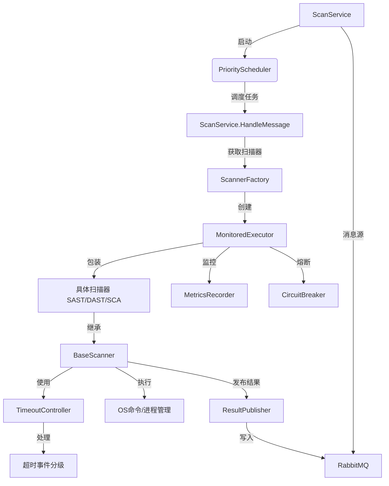
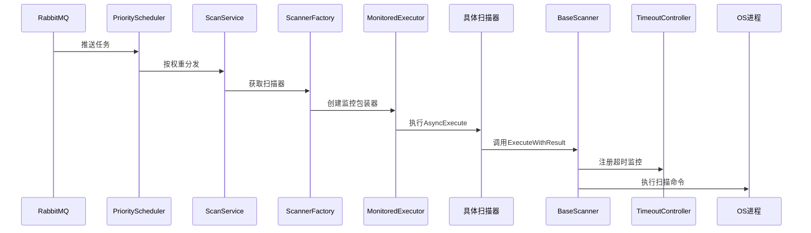
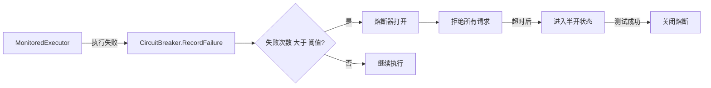
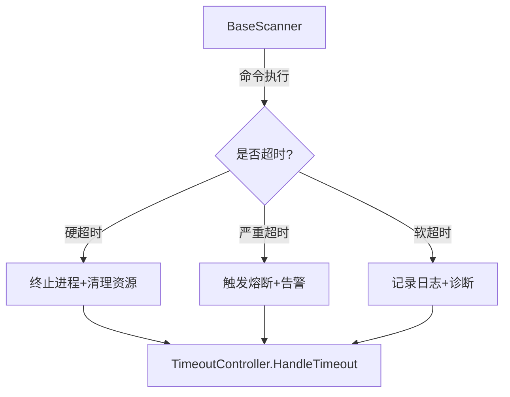

# 系统组件理解
1. ScanService：系统入口服务，负责初始化消息队列连接、扫描器工厂、任务调度器
2. PriorityScheduler：实现任务优先级调度算法（高/中/低三级权重）
3. ScannerFactory：扫描器工厂，创建和管理扫描器实例（含熔断机制）
4. BaseScanner：所有扫描器的基类，提供公共功能（命令执行、资源控制等）
5. SAST/DAST/SCAScanner：具体扫描器实现（静态/动态/成分分析）
6. MonitoredExecutor：扫描器装饰器，添加监控和熔断功能
7. TimeoutController：任务超时控制器（软/硬/严重三级超时）
8. CircuitBreaker：熔断器实现（关闭/打开/半开三态）

# 系统调用图

# 关键流程说明
## 任务调度流程

## 熔断机制流程

## 超时处理流程

