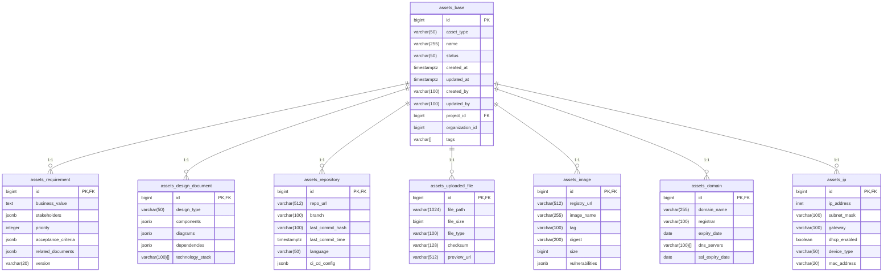

资产数据库详细设计

根据提供的 AssetType 枚举类型，我将为您设计完整的基表及扩展表方案。这个设计将遵循以下原则：
1. 所有资产类型共享公共属性 - 使用基表存储
2. 每种资产类型有独特属性 - 使用扩展表存储
3. 通过外键关联基表和扩展表
4. 支持高效查询和扩展

# 一、基表设计：assets_base
## 表结构
```sql
CREATE TABLE assets_base (
    id BIGSERIAL PRIMARY KEY,                   -- 主键
    asset_type VARCHAR(50) NOT NULL,            -- 资产类型（使用AssetType.String()的值）
    name VARCHAR(255) NOT NULL,                 -- 资产名称
    status VARCHAR(50) NOT NULL,                -- 资产状态（active/inactive/deleted）
    created_at TIMESTAMP WITH TIME ZONE DEFAULT CURRENT_TIMESTAMP, -- 创建时间
    updated_at TIMESTAMP WITH TIME ZONE DEFAULT CURRENT_TIMESTAMP, -- 更新时间
    created_by VARCHAR(100) NOT NULL,           -- 创建者
    updated_by VARCHAR(100) NOT NULL,           -- 最后更新者
    
    -- 通用业务属性
    project_id BIGINT REFERENCES projects(id),   -- 所属项目
    organization_id BIGINT NOT NULL,             -- 所属组织
    tags VARCHAR[] DEFAULT '{}',                 -- 标签数组
    
    -- 索引
    CONSTRAINT fk_project FOREIGN KEY(project_id) REFERENCES projects(id),
    INDEX idx_asset_type (asset_type),
    INDEX idx_organization (organization_id),
    INDEX idx_created_at (created_at)
);

COMMENT ON TABLE assets_base IS '资产基表';
COMMENT ON COLUMN assets_base.asset_type IS '资产类型 (Requirement, DesignDocument, etc.)';
COMMENT ON COLUMN assets_base.status IS '资产状态: active, inactive, deleted';
```
## 字段说明
| 字段	              | 类型	           | 描述                              |
|------------------|---------------|---------------------------------|
| id	              | BIGSERIAL	    | 自增主键                            |
| asset_type	      | VARCHAR(50)	  | 资产类型（使用 AssetType.String() 返回值） |
| name	            | VARCHAR(255)	 | 资产名称                            |
| status	          | VARCHAR(50)	  | 资产状态（active/inactive/deleted）   |
| created_at	      | TIMESTAMPTZ	  | 创建时间                            |
| updated_at	      | TIMESTAMPTZ	  | 最后更新时间                          |
| created_by	      | VARCHAR(100)	 | 创建者ID                           |
| updated_by	      | VARCHAR(100)	 | 最后更新者ID                         |
| project_id	      | BIGINT	       | 所属项目ID                          |
| organization_id	 | BIGINT	       | 所属组织ID                          |
| tags	            | VARCHAR[]	    | 标签数组                            |
# 二、扩展表设计（每种资产类型一个扩展表）
## 1. 需求文档 (AssetTypeRequirement)
```sql
CREATE TABLE assets_requirement (
    id BIGINT PRIMARY KEY REFERENCES assets_base(id), -- 主键同时也是外键
    business_value TEXT,                               -- 业务价值描述
    stakeholders JSONB NOT NULL DEFAULT '[]',          -- 利益相关者列表
    priority INTEGER NOT NULL DEFAULT 0,                -- 优先级 (0-10)
    acceptance_criteria JSONB,                         -- 验收标准
    related_documents JSONB,                           -- 相关文档
    version VARCHAR(20) NOT NULL,                      -- 版本号
    
    -- 索引
    INDEX idx_priority (priority)
);

COMMENT ON TABLE assets_requirement IS '需求文档资产扩展表';
COMMENT ON COLUMN assets_requirement.stakeholders IS 'JSON格式的利益相关者列表';
```
## 2. 设计文档 (AssetTypeDesignDocument)
```sql
CREATE TABLE assets_design_document (
    id BIGINT PRIMARY KEY REFERENCES assets_base(id),
    design_type VARCHAR(50) NOT NULL,                  -- 设计类型 (UML, ERD, Flowchart等)
    components JSONB NOT NULL DEFAULT '[]',              -- 设计组件
    diagrams JSONB,                                     -- 相关图表
    dependencies JSONB,                                 -- 依赖项
    technology_stack VARCHAR(100)[],                   -- 技术栈
    
    -- 索引
    INDEX idx_design_type (design_type)
);

COMMENT ON TABLE assets_design_document IS '设计文档资产扩展表';
COMMENT ON COLUMN assets_design_document.diagrams IS '关联的图表文件ID列表';
```
## 3. 代码仓库 (AssetTypeRepository)
```sql
CREATE TABLE assets_repository (
    id BIGINT PRIMARY KEY REFERENCES assets_base(id),
    repo_url VARCHAR(512) NOT NULL,                    -- 仓库URL
    branch VARCHAR(100) NOT NULL DEFAULT 'main',        -- 默认分支
    last_commit_hash VARCHAR(100),                      -- 最后提交的哈希
    last_commit_time TIMESTAMP WITH TIME ZONE,          -- 最后提交时间
    language VARCHAR(50) NOT NULL,                      -- 主要编程语言
    ci_cd_config JSONB,                                -- CI/CD配置
    
    -- 索引
    INDEX idx_repo_url (repo_url),
    INDEX idx_language (language)
);

COMMENT ON TABLE assets_repository IS '代码仓库资产扩展表';
```
## 4. 上传文件 (AssetTypeUploadedFile)
```sql
CREATE TABLE assets_uploaded_file (
    id BIGINT PRIMARY KEY REFERENCES assets_base(id),
    file_path VARCHAR(1024) NOT NULL,                   -- 文件存储路径
    file_size BIGINT NOT NULL,                          -- 文件大小（字节）
    file_type VARCHAR(100) NOT NULL,                    -- 文件类型 (pdf, jpg, docx等)
    checksum VARCHAR(128) NOT NULL,                     -- 文件校验和
    preview_url VARCHAR(512),                           -- 预览URL
    
    -- 索引
    INDEX idx_file_type (file_type)
);

COMMENT ON TABLE assets_uploaded_file IS '上传文件资产扩展表';
```
## 5. 容器镜像 (AssetTypeImage)
```sql
CREATE TABLE assets_image (
    id BIGINT PRIMARY KEY REFERENCES assets_base(id),
    registry_url VARCHAR(512) NOT NULL,                -- 镜像仓库URL
    image_name VARCHAR(255) NOT NULL,                   -- 镜像名称
    tag VARCHAR(100) NOT NULL DEFAULT 'latest',        -- 标签
    digest VARCHAR(200) NOT NULL,                       -- 镜像摘要
    size BIGINT NOT NULL,                               -- 镜像大小
    vulnerabilities JSONB,                             -- 安全漏洞信息
    
    -- 索引
    INDEX idx_image_name (image_name),
    INDEX idx_registry (registry_url)
);

COMMENT ON TABLE assets_image IS '容器镜像资产扩展表';
```
## 6. 域名 (AssetTypeDomain)
```sql
CREATE TABLE assets_domain (
    id BIGINT PRIMARY KEY REFERENCES assets_base(id),
    domain_name VARCHAR(255) NOT NULL,                  -- 域名
    registrar VARCHAR(100),                             -- 注册商
    expiry_date DATE NOT NULL,                          -- 过期日期
    dns_servers VARCHAR(100)[],                        -- DNS服务器
    ssl_expiry_date DATE,                               -- SSL证书过期日期
    
    -- 索引
    INDEX idx_domain_name (domain_name),
    INDEX idx_expiry (expiry_date)
);

COMMENT ON TABLE assets_domain IS '域名资产扩展表';
```
## 7. IP地址 (AssetTypeIP)
```sql
CREATE TABLE assets_ip (
    id BIGINT PRIMARY KEY REFERENCES assets_base(id),
    ip_address INET NOT NULL,                           -- IP地址
    subnet_mask VARCHAR(100),                            -- 子网掩码
    gateway VARCHAR(100),                               -- 网关
    dhcp_enabled BOOLEAN DEFAULT FALSE,                 -- 是否启用DHCP
    device_type VARCHAR(50),                            -- 设备类型
    mac_address VARCHAR(20),                            -- MAC地址
    
    -- 索引
    INDEX idx_ip_address (ip_address),
    INDEX idx_device_type (device_type)
);

COMMENT ON TABLE assets_ip IS 'IP地址资产扩展表';
```
# 三、关系设计图

# 五、GORM模型实现
## 基表模型

```go
// Package model internal/asset/repository/model/base_asset.go
package model

import (
	"time"
)

type BaseAsset struct {
	ID             uint           `gorm:"primaryKey"`
	AssetType      string         `gorm:"size:50;not null;index"`
	Name           string         `gorm:"size:255;not null"`
	Status         string         `gorm:"size:50;not null;default:'active'"`
	CreatedAt      time.Time      `gorm:"autoCreateTime"`
	UpdatedAt      time.Time      `gorm:"autoUpdateTime"`
	CreatedBy      string         `gorm:"size:100;not null"`
	UpdatedBy      string         `gorm:"size:100;not null"`
	ProjectID      uint           `gorm:"index"`
	OrganizationID uint           `gorm:"not null;index"`
	Tags           pq.StringArray `gorm:"type:varchar(100)[];default:'{}'"`
}

func (BaseAsset) TableName() string {
	return "assets_base"
}
```
## 需求文档扩展模型
```go
// internal/asset/repository/model/requirement_asset.go
package model

import (
	"encoding/json"
	"gorm.io/datatypes"
)

type RequirementAsset struct {
	ID                uint           `gorm:"primaryKey"`
	BusinessValue     string         `gorm:"type:text"`
	Stakeholders      datatypes.JSON `gorm:"type:jsonb;not null"`
	Priority          int            `gorm:"not null;default:0;index"`
	AcceptanceCriteria datatypes.JSON `gorm:"type:jsonb"`
	RelatedDocuments  datatypes.JSON `gorm:"type:jsonb"`
	Version           string         `gorm:"size:20;not null"`
}

// 自定义方法：获取利益相关者列表
func (r *RequirementAsset) GetStakeholders() ([]string, error) {
	var stakeholders []string
	err := json.Unmarshal(r.Stakeholders, &stakeholders)
	return stakeholders, err
}

func (RequirementAsset) TableName() string {
	return "assets_requirement"
}
```
# 六、数据库迁移策略
## 初始化迁移
```go
// repository/migration.go
func AutoMigrate(db *gorm.DB) error {
	models := []interface{}{
		&model.BaseAsset{},
		&model.RequirementAsset{},
		&model.DesignDocumentAsset{},
		&model.RepositoryAsset{},
		&model.UploadedFileAsset{},
		&model.ImageAsset{},
		&model.DomainAsset{},
		&model.IPAsset{},
	}
	
	for _, m := range models {
		if err := db.AutoMigrate(m); err != nil {
			return fmt.Errorf("failed to migrate %T: %w", m, err)
		}
	}
	
	// 添加外键约束
	if err := db.Exec(`
		ALTER TABLE assets_requirement 
		ADD CONSTRAINT fk_base_requirement 
		FOREIGN KEY (id) REFERENCES assets_base(id)
	`).Error; err != nil {
		return err
	}
	
	// 类似添加其他扩展表的外键约束...
	
	return nil
}
```
## 增量迁移
1. 使用数据库迁移工具（如golang-migrate）
2. 每个变更一个迁移文件
3. 支持回滚操作


