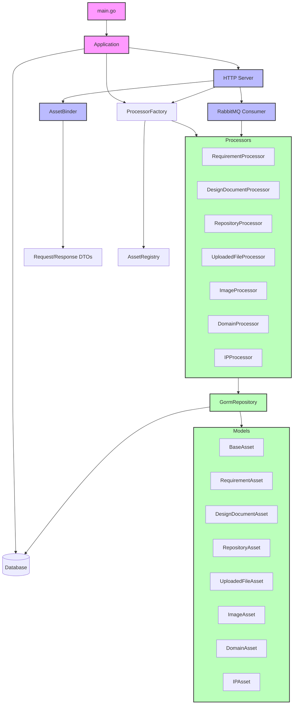

我会根据代码结构生成一个完整的调用关系图，包括各个层次之间的交互：

这个图展示了以下关键调用关系：
1. 入口层：
   1. main.go 初始化 Application
   2. Application 管理 HTTP 服务器、数据库和处理器工厂
2. HTTP 层：
   1. HTTPServer 处理 HTTP 请求
   2. AssetBinder 负责请求绑定
   3. 使用 DTO 进行数据传输
3. 业务逻辑层：
   1. ProcessorFactory 管理所有资产处理器
   2. 每种资产类型有对应的处理器
   3. 处理器通过仓储层访问数据
4. 仓储层：
   1. GormRepository 实现数据访问
   2. 使用 GORM 模型映射数据库表
   3. 支持事务和 CRUD 操作
5. 基础设施层：
   1. 数据库连接管理
   2. 资产注册中心
   3. 消息队列集成
6. 消息队列：
   1. RabbitMQ 消费者处理异步任务
   2. 与处理器层交互

主要数据流向：
1. HTTP 请求 → Binder → 处理器 → 仓储 → 数据库
2. 消息队列 → 处理器 → 仓储 → 数据库
3. 数据库 → 仓储 → 处理器 → HTTP 响应

这个架构遵循了：
1. 依赖注入原则
2. 接口隔离原则
3. 单一职责原则
4. 关注点分离

每个组件都有明确的职责，通过接口进行解耦，便于测试和维护。
