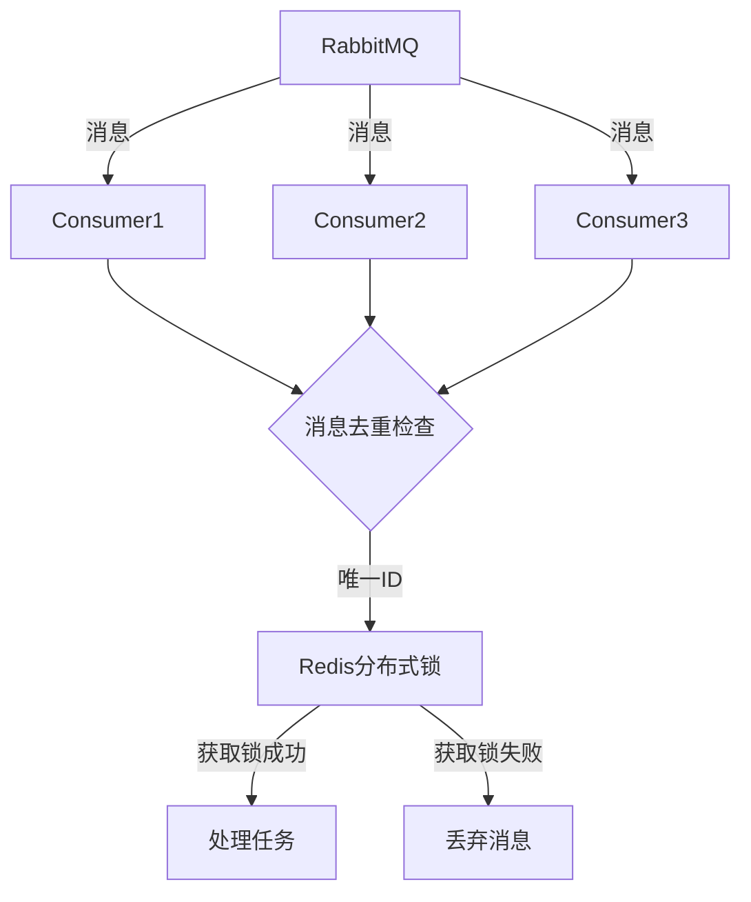
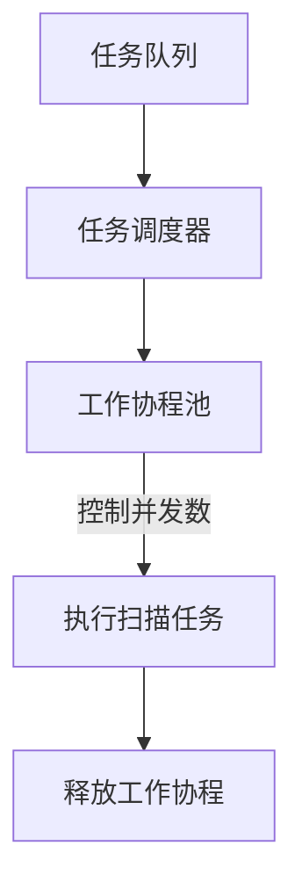
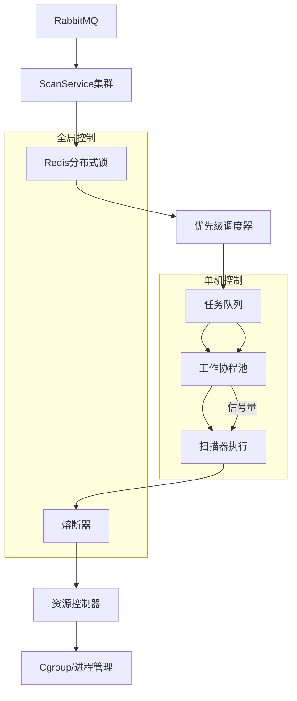

# 1. 消息重复消费问题
问题核心：多个 scan-service 实例同时消费 RabbitMQ 时可能重复处理消息
解决方案：

实现要点：
1. 消息唯一标识：在任务消息中添加全局唯一ID（如UUID）
2. 分布式锁：使用 Redis 实现分布式锁机制
3. 幂等处理：在 HandleMessage 中添加去重逻辑
```go
// 在 ScanService.HandleMessage 中添加
func (s *ScanService) HandleMessage(ctx context.Context, message []byte) error {
    // 解析任务
    var task domain.ScanTaskPayload
    if err := json.Unmarshal(message, &task); err != nil {
        return err
    }

    // 获取分布式锁
    lockKey := fmt.Sprintf("task_lock:%s", task.TaskID)
    acquired, err := s.redisClient.SetNX(ctx, lockKey, "1", 10*time.Minute).Result()
    if err != nil || !acquired {
        return fmt.Errorf("task already being processed")
    }
    defer s.redisClient.Del(ctx, lockKey)

    // ... 原有处理逻辑 ...
}
```
# 2. 单机任务并发控制
问题核心：AsyncExecute 无限制创建协程导致资源耗尽
解决方案：

实现要点：
1. 工作协程池：在 BaseScanner 中实现
2. 信号量控制：使用带缓冲的 channel 作为并发控制器
3. 队列管理：添加任务队列缓冲机制
```go
// 在 BaseScanner 中添加协程池管理
type BaseScanner struct {
    // ... 原有字段 ...
    workerPool   chan struct{} // 协程池控制
    taskQueue    chan func()   // 任务队列
}

func NewBaseScanner(/*...*/, maxConcurrency int) *BaseScanner {
    bs := &BaseScanner{
        workerPool: make(chan struct{}, maxConcurrency),
        taskQueue:  make(chan func(), 1000), // 缓冲队列
    }
    go bs.startWorkerPool()
    return bs
}

func (s *BaseScanner) startWorkerPool() {
    for task := range s.taskQueue {
        s.workerPool <- struct{}{} // 获取令牌
        go func(t func()) {
            defer func() { <-s.workerPool }() // 释放令牌
            t()
        }(task)
    }
}

// 修改 AsyncExecute 实现
func (s *SASTScanner) AsyncExecute(ctx context.Context, task *domain.ScanTaskPayload) (string, error) {
    s.BaseScanner.taskQueue <- func() {
        _ = s.BaseScanner.ExecuteWithResult(ctx, task, func(ctx context.Context) (*domain.ScanResult, error) {
            return s.Scan(ctx, task)
        })
    }
    return task.TaskID, nil
}
```
# 3. 其他生产级优化建议
## 3.1 资源泄漏风险
问题：BaseScanner.ExecuteCommand 中的资源清理不完整
修复：
```go
// 在 ExecuteCommand 中确保资源释放
defer func() {
    if s.cgroupManager != nil {
        if err := s.cgroupManager.Cleanup(); err != nil {
            s.logger.Error("cgroup cleanup failed", zap.Error(err))
        }
    }
}()
```
## 3.2 熔断机制增强
问题：当前熔断器未考虑不同错误类型的差异化处理
优化：
```go
// 在 CircuitBreaker 中添加错误分类
func (cb *CircuitBreaker) RecordFailure(errType ErrorType) {
    cb.mu.Lock()
    defer cb.mu.Unlock()
    
    switch errType {
    case TransientError:
        atomic.AddUint32(&cb.transientFailures, 1)
    case CriticalError:
        atomic.AddUint32(&cb.criticalFailures, 1)
        cb.lastFailure = time.Now()
    }
}

// 修改 IsOpen 逻辑
func (cb *CircuitBreaker) IsOpen() bool {
    if atomic.LoadUint32(&cb.criticalFailures) >= cb.criticalThreshold {
        return true
    }
    // ... 原有逻辑 ...
}
```
## 3.3 监控指标不足
问题：缺少关键运行时指标
增强：
```go
// 在 MonitoredExecutor 中添加
func (m *MonitoredExecutor) AsyncExecute(ctx context.Context, task *domain.ScanTaskPayload) (string, error) {
    // 添加队列等待时间监控
    queueStart := time.Now()
    // ... 等待进入工作池 ...
    m.metrics.RecordQueueWaitTime(m.scanType, time.Since(queueStart))
    
    // 添加任务执行时间监控
    start := time.Now()
    // ... 执行任务 ...
    m.metrics.RecordExecutionTime(m.scanType, time.Since(start))
}
```
# 系统优化后架构

# 关键优化总结
1. 消息去重：通过 Redis 分布式锁实现跨进程任务去重
2. 资源管控：
   1. 工作协程池控制最大并发
   2. 带缓冲任务队列防止突发流量
   3. Cgroup 资源隔离保障稳定性
3. 状态管理：
   1. 完善任务生命周期跟踪
   2. 增强熔断机制（区分错误类型）
4. 监控增强：
   1. 添加队列等待时间指标
   2. 完善任务执行时间统计
5. 生产加固：
   1. 确保资源释放（cgroup/进程）
   2. 增加优雅关闭处理
   3. 完善错误恢复机制

这些优化将使系统具备生产级可靠性，能够有效控制资源使用，防止单点故障，并提供完善的监控能力。建议在 Redis 锁的实现中加入自动续期机制，并考虑添加任务超时自动取消功能以进一步保障系统稳定性。