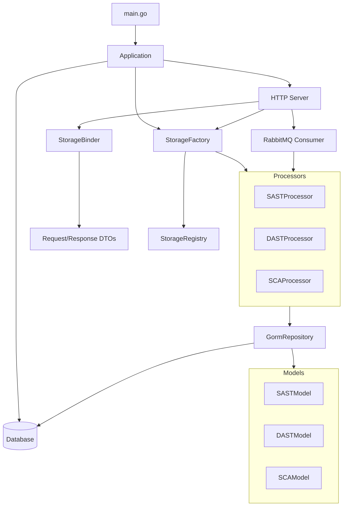

```mermaid
graph TB
    %% 主要组件
    Main[main.go] --> App[Application]
    App --> HTTPServer[HTTP Server]
    App --> DB[(Database)]
    App --> Factory[StorageFactory]

    %% HTTP层
    HTTPServer --> Binder[StorageBinder]
    HTTPServer --> Factory
    Binder --> DTO[Request/Response DTOs]

    %% 业务逻辑层
    Factory --> Processors[Storage Processors]
    subgraph Processors
        SAST[SASTProcessor]
        DAST[DASTProcessor]
        SCA[SCAProcessor]
    end

    %% 仓储层
    Processors --> Repository[GormRepository]
    Repository --> Models[GORM Models]
    subgraph Models
        SAST_Model[SASTModel]
        DAST_Model[DASTModel]
        SCA_Model[SCAModel]
    end

    %% 基础设施层
    Repository --> DB
    Factory --> Registry[StorageRegistry]

    %% 消息队列
    HTTPServer --> MQ[RabbitMQ Consumer]
    MQ --> Processors
```